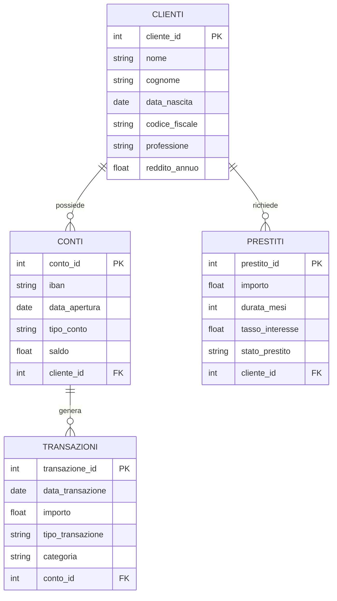

# 🏦 Banca Trinacria – Database Schema

Questo documento descrive lo **schema relazionale del database bancario** del progetto *Banca Trinacria*.

Lo schema è stato progettato per essere:
- realistico (contesto bancario italiano)
- normalizzato
- facilmente interrogabile per analisi SQL e BI
- adatto a progetti di **data analysis, credit risk e customer analytics**

---

## 🎯 Obiettivi dello schema

- Modellare clienti, conti e prodotti bancari
- Tracciare transazioni e prestiti
- Supportare analisi di rischio e comportamento
- Garantire integrità referenziale

---

## 🧱 Entità principali

### 👤 Clienti
Contiene le informazioni anagrafiche e demografiche dei clienti.

**Concetti chiave:**
- identificazione cliente
- dati personali e fiscali
- relazione 1‑N con conti e prestiti

---

### 🏦 Conti Correnti
Rappresenta i conti bancari associati ai clienti.

**Concetti chiave:**
- IBAN
- tipo di conto
- data di apertura
- saldo

Relazione:
- **Cliente 1 → N Conti**

---

### 💳 Transazioni
Traccia tutti i movimenti bancari.

**Concetti chiave:**
- importo
- data
- categoria
- tipo di operazione

Relazione:
- **Conto 1 → N Transazioni**

---

### 💼 Prestiti
Gestisce i prestiti concessi ai clienti.

**Concetti chiave:**
- importo
- durata
- tasso di interesse
- stato del prestito (performing / NPL)

Relazione:
- **Cliente 1 → N Prestiti**

---

## 🔗 Relazioni principali

- Cliente → Conti (1:N)
- Conto → Transazioni (1:N)
- Cliente → Prestiti (1:N)

Lo schema consente analisi incrociate su:
- comportamento transazionale
- esposizione creditizia
- rischio cliente

---

## 📐 Diagramma ER (Mermaid)

Il seguente diagramma può essere renderizzato direttamente su GitHub.

---

## 📊 Analisi supportate

- Saldo e flussi per cliente
- Pattern di spesa
- Analisi NPL
- Segmentazione clienti
- KPI bancari per dashboard BI

---

## ⚠️ Disclaimer

Lo schema e i dati associati sono **interamente fittizi** e creati a scopo dimostrativo.

---

## 👤 Autore

**Vincenzo Alesi**  
Data Analyst

---

✨ Possibili estensioni:
- tabelle storiche (SCD)
- scoring clienti
- viste analitiche
- materialized views per BI

